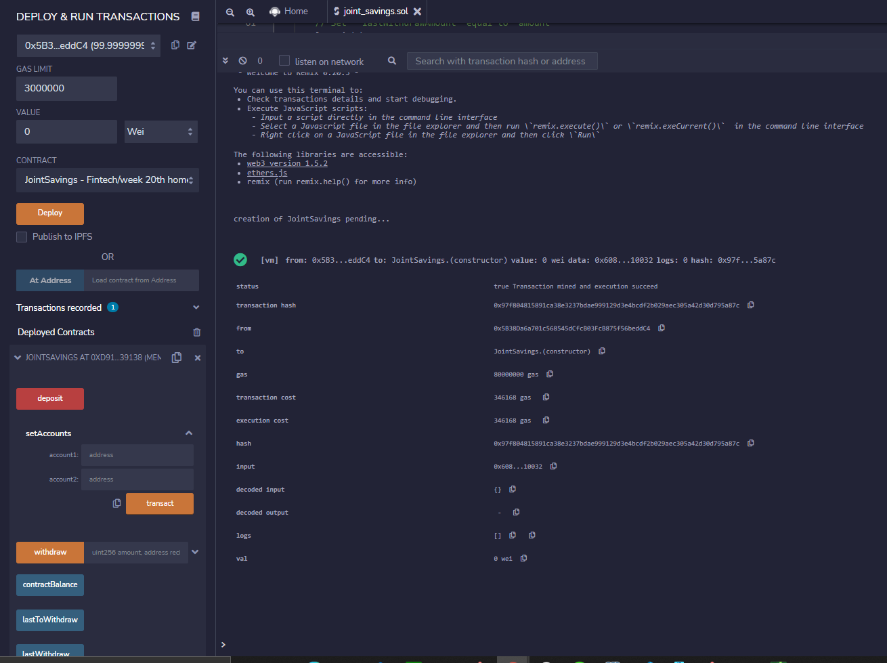
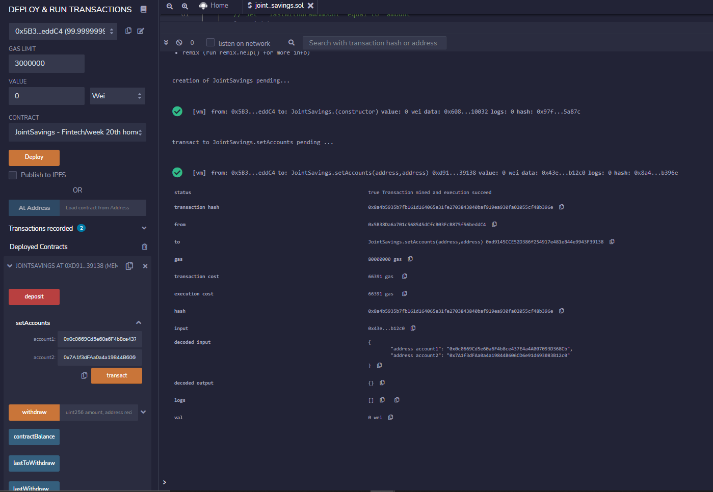
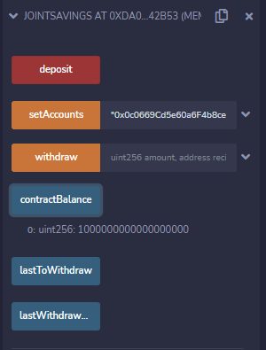
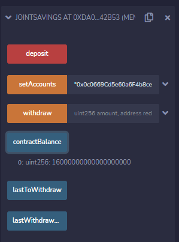
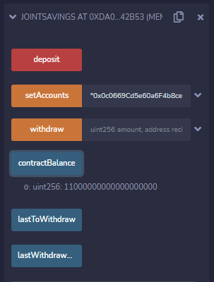
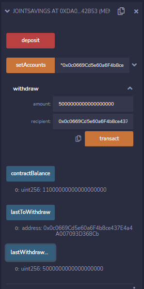
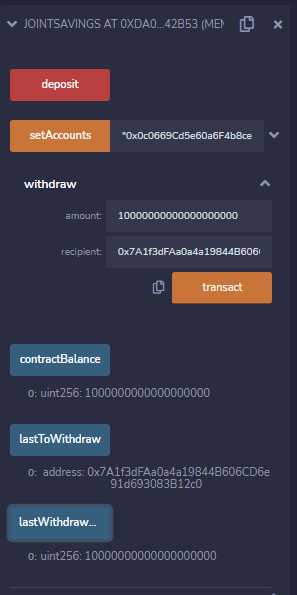

# Smart Contract Joint Savings Account

Smart Contract implementing a joint savings account 

Deployed the contract

Setting up the two accounts

Deposited 1 ETH as WEI

Deposited 5 ETH as WEI

Deposited 10 ETH as WEI

Withdrawing 5 ETH into account1

Withdrawing 10 ETH into account2

